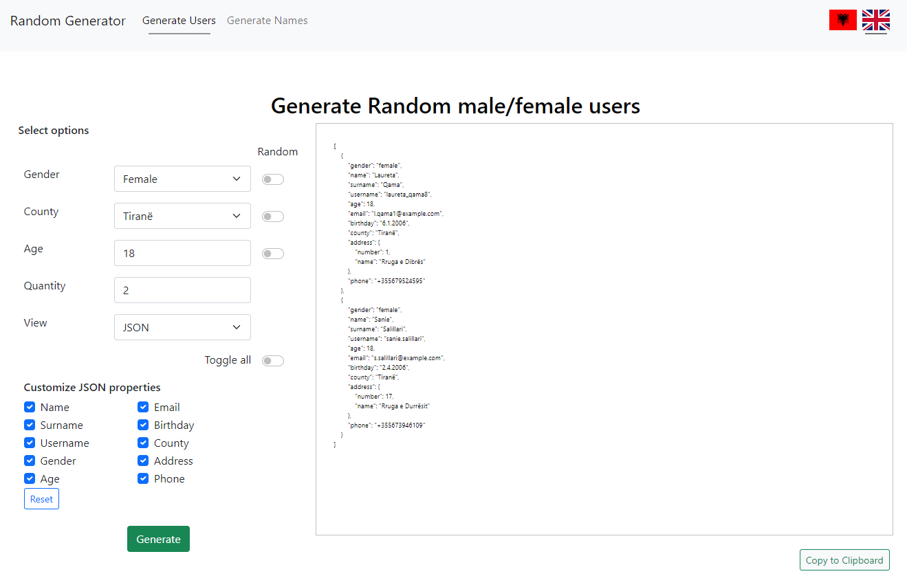

# Random Albanian User Data Generator

This project was generated with [Angular CLI](https://github.com/angular/angular-cli) version 17.1.0

# Description

This website is an an open source attempt at providing developers with a simple to use user interface for generating random albanian user data.

Customized, names, surnames, steet names, phone numbers.

Also Random Images are generated for people of different ages to depict the closest to real life data for developers.

# UI

Current User Interface as of 20.01.2024 looks like this:

## Development server

Run `ng serve` for a dev server. Navigate to `http://localhost:4200/`. The application will automatically reload if you change any of the source files.

## Code scaffolding

Run `ng generate component component-name` to generate a new component. You can also use `ng generate directive|pipe|service|class|guard|interface|enum|module`.

## Build

Run `ng build` to build the project. The build artifacts will be stored in the `dist/` directory.

## Running unit tests

Run `ng test` to execute the unit tests via [Karma](https://karma-runner.github.io).

## Running end-to-end tests

Run `ng e2e` to execute the end-to-end tests via a platform of your choice. To use this command, you need to first add a package that implements end-to-end testing capabilities.

## Further help

To get more help on the Angular CLI use `ng help` or go check out the [Angular CLI Overview and Command Reference](https://angular.io/cli) page.
